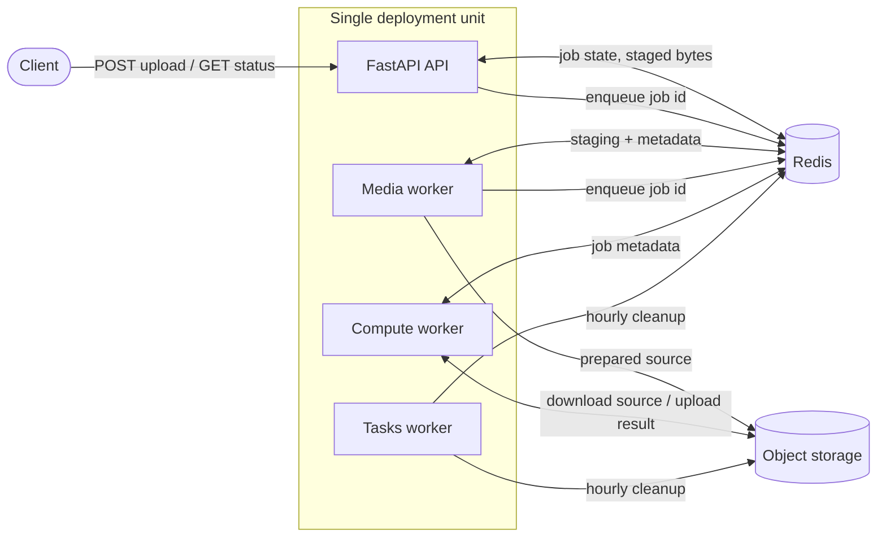
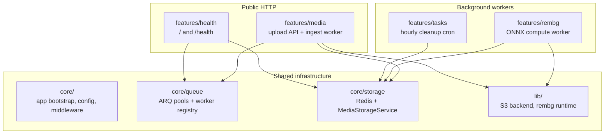
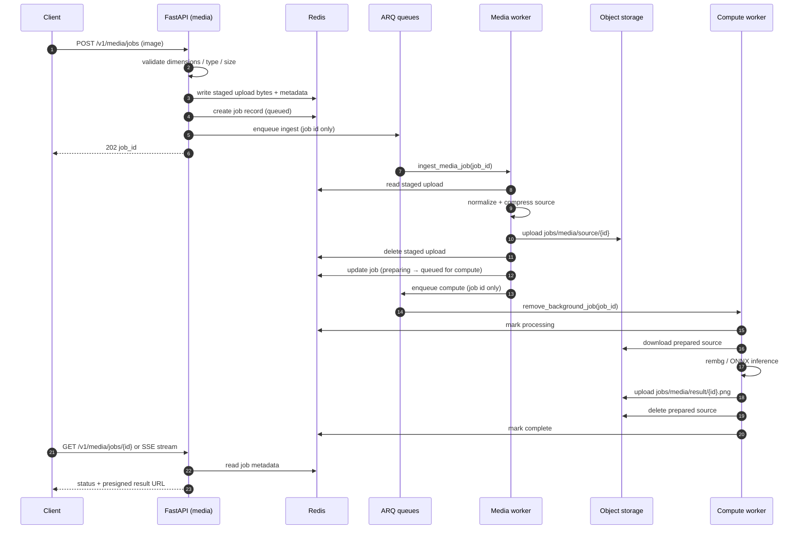
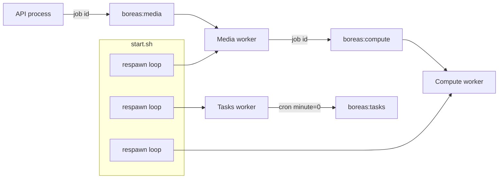
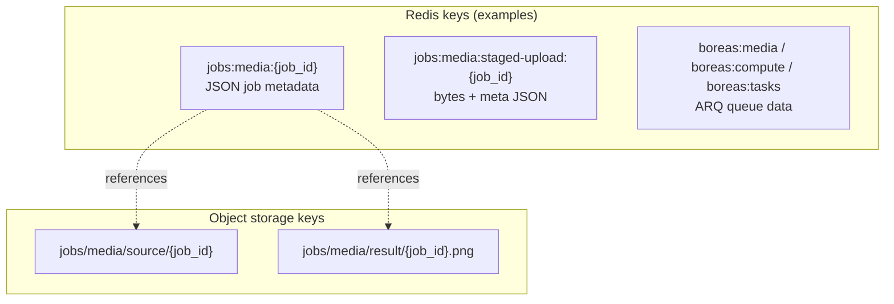
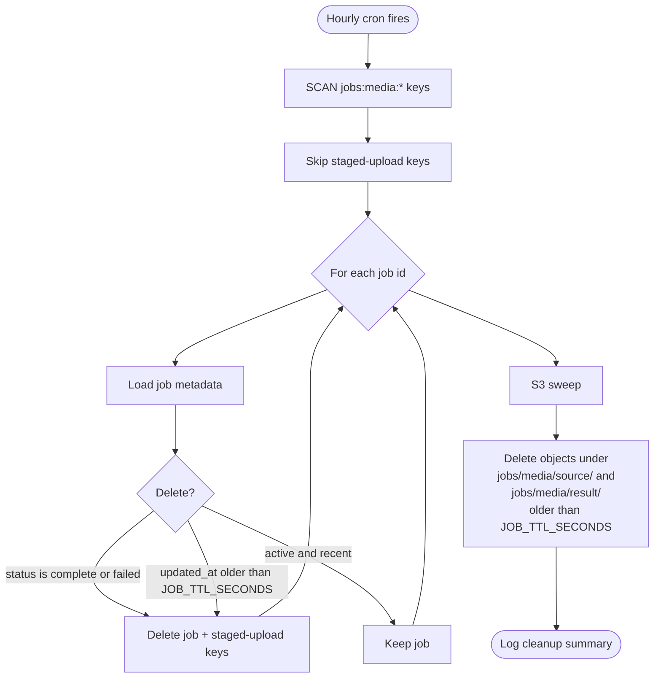
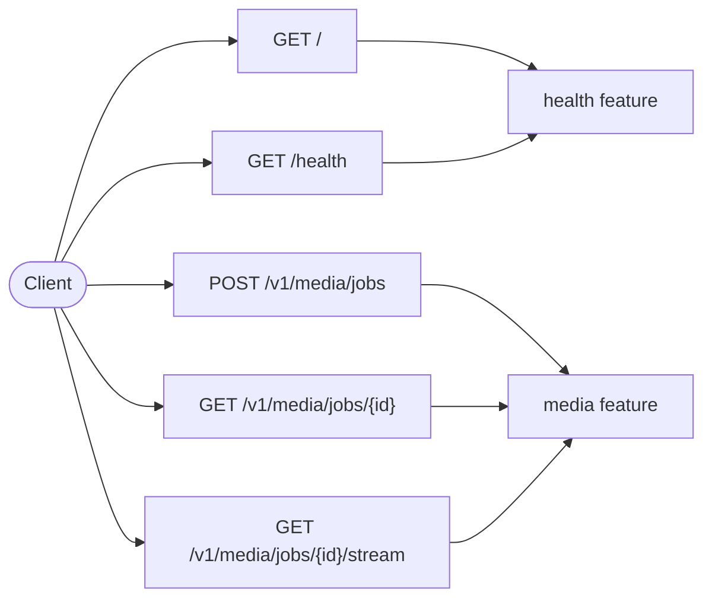

# Boreas Architecture

Visual overview of how Boreas runs today. For rationale and tradeoffs, see [system-design.md](system-design.md).

## What Boreas Is

A narrow async pipeline: accept an image upload over HTTP, return a job id immediately, process background removal off-request, and deliver a result URL when ready.

## Feature Ownership

## End-to-End Job Flow

## Queues And Workers

ARQ uses Redis as the broker. Queue payloads are **job ids only** — never image bytes.

| Queue            | Worker         | Responsibility                   |
| ---------------- | -------------- | -------------------------------- |
| `boreas:media`   | Media worker   | ingest, normalize, upload source |
| `boreas:compute` | Compute worker | background removal               |
| `boreas:tasks`   | Tasks worker   | hourly cleanup cron              |

Worker crash recovery: bash respawn loop in `start.sh` (restart after exit). Hung ONNX: `REMBG_INFERENCE_TIMEOUT_SECONDS` inside the compute worker, then retry via ARQ.

## Data Placement

Redis holds **coordination state**. Object storage holds **files**.

| Data                | Store       | Lifetime                                                     |
| ------------------- | ----------- | ------------------------------------------------------------ |
| Raw upload (staged) | Redis bytes | Short (`MEDIA_STAGING_TTL_SECONDS`); deleted after ingest    |
| Job metadata        | Redis JSON  | Until terminal sweep or age cutoff                           |
| Prepared source     | S3          | Deleted after successful compute                             |
| Final result        | S3          | Presigned URL TTL + bucket lifecycle; orphan sweep as backup |

## Cleanup Policy (Hourly Tasks Cron)

The cleaner does **not** wipe all jobs. It removes **finished work** and **stale/orphan data** so Redis and S3 do not grow without bound.

### Redis — what gets deleted

| Condition                                          | Action                                                      |
| -------------------------------------------------- | ----------------------------------------------------------- |
| `complete` or `failed`                             | Delete immediately on next hourly run                       |
| Any status, `updated_at` ≤ now − `JOB_TTL_SECONDS` | Delete (covers stuck `queued` / `preparing` / `processing`) |
| Active job, recently updated                       | **Kept**                                                    |

Default `JOB_TTL_SECONDS` = 3600 (1 hour).

### S3 — what gets deleted

Objects under `jobs/media/source/` and `jobs/media/result/` whose `LastModified` is older than `JOB_TTL_SECONDS`. This catches orphans when workers fail or lifecycle rules are misconfigured. Normal happy path already deletes the source after compute.

### What the cleaner does not do

- Does not stop in-flight workers or cancel active jobs that are still within TTL
- Does not replace bucket lifecycle rules for results (those remain the primary expiry mechanism)
- Does not scan unrelated Redis keys (rate limits, ARQ internals, etc.)

## HTTP Surface

## Configuration Knobs (Operational)

| Variable                                                         | Role                                                              |
| ---------------------------------------------------------------- | ----------------------------------------------------------------- |
| `JOB_TTL_SECONDS`                                                | Max job age before forced Redis delete; S3 orphan sweep threshold |
| `MEDIA_STAGING_TTL_SECONDS`                                      | Staged upload expiry in Redis                                     |
| `RESULT_URL_TTL_SECONDS`                                         | Presigned download URL lifetime                                   |
| `REMBG_INFERENCE_TIMEOUT_SECONDS`                                | ONNX wall-clock timeout per attempt                               |
| `MEDIA_WORKERS` / `BACKGROUND_REMOVAL_WORKERS` / `TASKS_WORKERS` | Worker process counts                                             |

## Related Docs

- [system-design.md](system-design.md) — design goals, tradeoffs, what we intentionally avoid
- [deployment-guide.md](deployment-guide.md) — production setup and lifecycle
- [integration-guide.md](integration-guide.md) — client integration patterns
